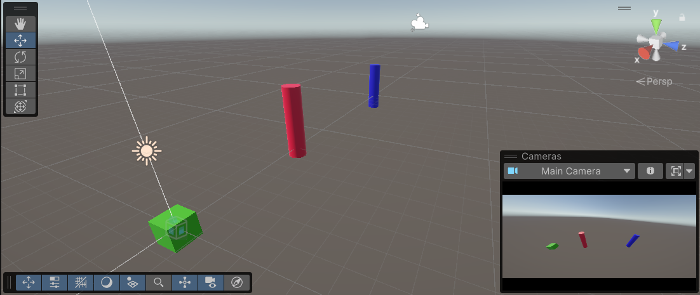
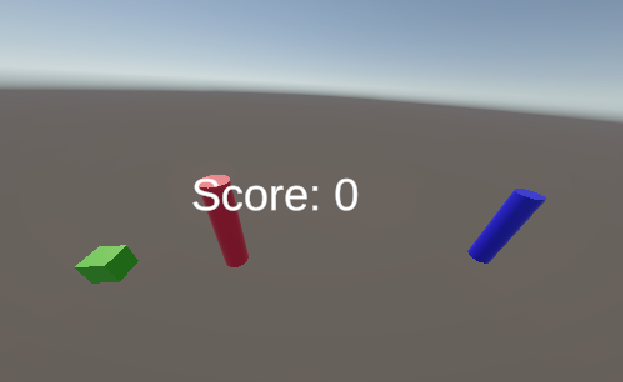

# UnityTestProject-CubeControl
This is the GitHub repository for my Unity test project, which is designed to control a cube through gates. 

## Description
In this first test game, your goal is to navigate the green cube through the two gates. The first gate is red and the second is blue. Think of it as a slalom course in alpine skiing. 
Use following keyboard commands to control the cube: 
- W: move right
- S: move left
- A: move forward
- D: move backward

## Still under construction!!
Launching soon: A scoreboard with a counter that indicates gate crossings. Currently the counter does not work for every gate crossing reliable.

## Info 
Since I am using an IPhone without a Mac, i could not display my App on the phone. I am in the group with Mara & Melvin, where Mara uploaded her App on the Android and displayed it (as discussed with you).  
